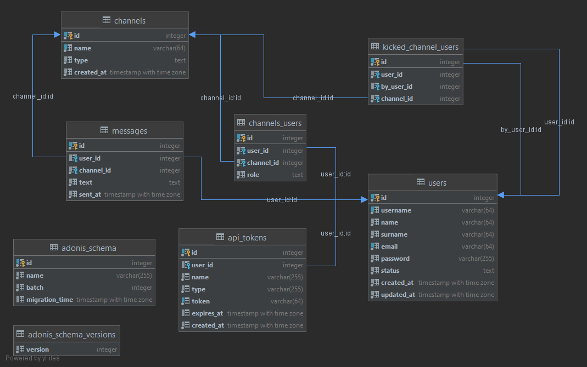

# Poormans Discord api (vpwa-backend)

A backend api server for a Discord clone prograssive web app written using Adonis.js for VPWA (Development of Progressive Web Applications) course. The app has various api REST endpoints as well as socket connections, to serve the frontend app.

## REST Endpoints

The app serves various endpoints across controllers serving users, channels and messages. The app also uses an authentication middleware that protects endpoints from unauthorized access, except endpoints for registration and login.

### Users

- **POST** /register
- **POST** /login
- **POST** /status
- **GET** /status
- **GET** /users

### Channels

- **GET** /channels
- **POST** /channel
- **DELETE** /channels

### Messages

- **GET** /messages

## Sockets

Socket connection is established with frontend application using socket.io library. Sockets handle notification accross clients when new messages are posted into channels, after new users are invited or removed from channels. Several more usecases are handled by sockets according to app specification.

## Data model

Data model below was created before implementation, and later implemented with migrations.

<b>Show database schema design</b>

<b>Show production database schema</b>

